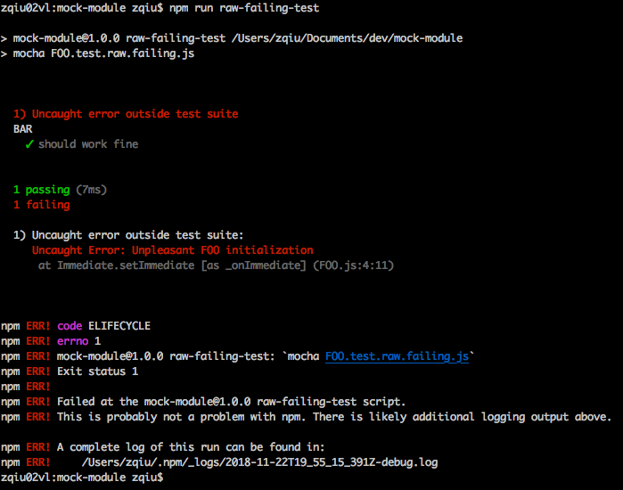
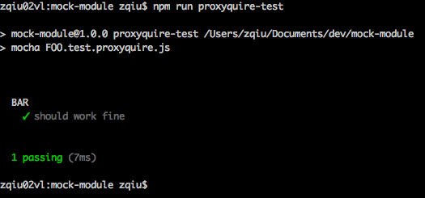
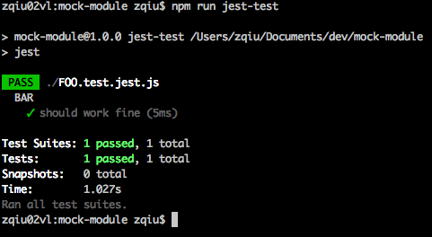

# Yet Another Demo of Module Mocking in Node JS


Demonstrate how to mock Node module in unit tests via `jest` or `proxyquire`.

## Scenario

* You are writing your Node JS module [`BAR.js`](./BAR.js) and its unit test file `BAR.test.js`
* [`BAR.js`](./BAR.js) depends on [`FOO.js`](./FOO.js)
* Loading [`BAR.js`](./BAR.js) from within `BAR.test.js` has side effect you want to avoid inside [`FOO.js`](./FOO.js)

```
FOO <---------------- BAR <-------------------- BAR.test
```

## First attempt

See [BAR.test.raw.failing.js](./BAR.test.raw.failing.js).

To run the example, you clone this repo to your local computer, perform `npm i`, and run `npm run raw-failing-test`. You will see the error message from console as below:



## Second attempt

See [BAR.test.proxyquire.js](./BAR.test.proxyquire.js).

To run the example, supposing you have cloned the repo and installed dependencies, just execute `npm run proxyquire-test`. You will see the success message from console as below:




## Third attempt
See [BAR.test.jest.js](./BAR.test.jest.js).

To run the example, supposing you have cloned the repo and installed dependencies, just execute `npm run jest-test`. You will see the success message from console as below:



## Conclusion

Both `proxyquire` and `jest` offer the capability to mock a while module cleanly. However `jest`'s capability is built-in and thus the preferred approach.

`jest` however imposes an inconvenience as it does not allow referencing external veriables when stuffing the mock. Hence the mock has to be in-place defined in the call of `jest.mock`.
